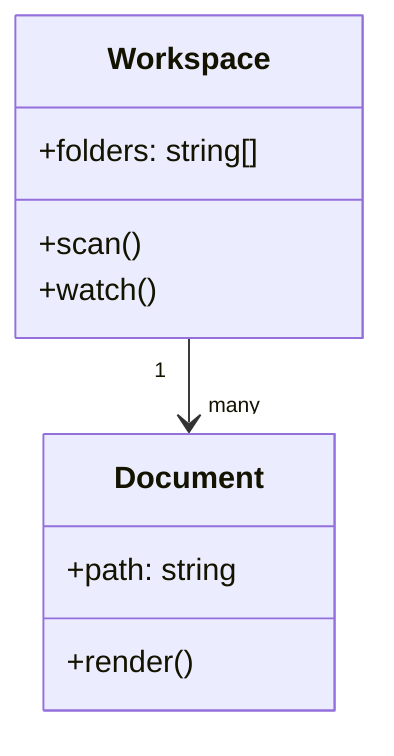

# Architecture

[← 예제 첫 페이지](../README.md)

## 구성

```mermaid
classDiagram
    class Workspace {
        +folders: string[]
        +scan()
        +watch()
    }
    class Document {
        +path: string
        +render()
    }
    Workspace "1" --> "many" Document
```

## 렌더링

Markdown 텍스트를 파싱한 뒤 HTML을 정화하고, 수식과 다이어그램을 표시합니다.

> [!WARNING]
> 문서 안의 JavaScript는 실행하지 않습니다.
